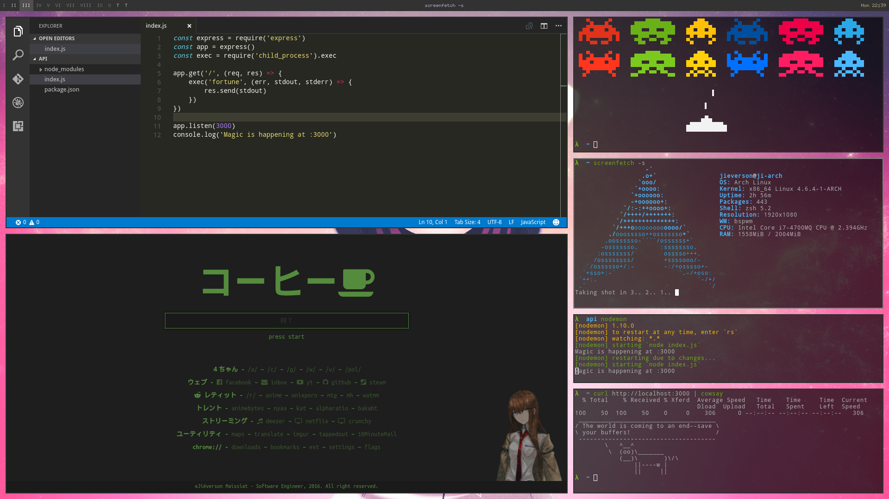
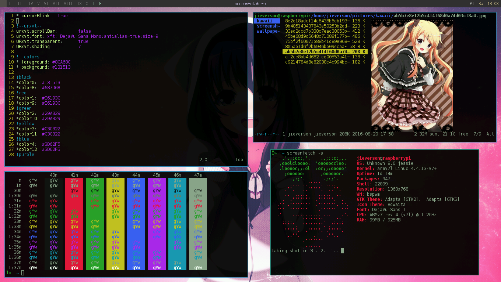

# .dotfiles
My arch linux configuration files. (See Arch Linux for Dummies [here](https://github.com/jieverson/dotfiles/wiki/arch-linux-for-dummies))

### usage
Just run `update.sh` for pull last git version and symlink all dotfiles.

```
$ git clone https://github.com/jieverson/dotfiles.git ~/.dotfiles
$ chmod +x ~/.dotfiles/update.sh
$ ~/.dotfiles/update.sh
```

> Make sure to have all `arch`, `bspwm` and `lemonbar` dependencies installed.

### screenshots
<p align="center">
  
</p>
<p align="center">
  
</p>
<p align="center">
  
</p>
<p align="center">
  
</p>

> **TODO:** fonts, pacman, aur & oh-my-zsh
